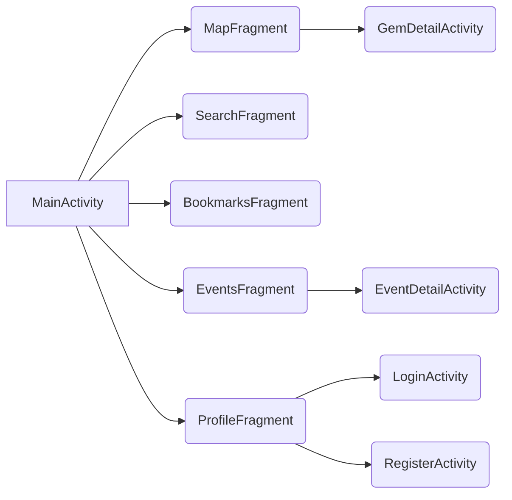
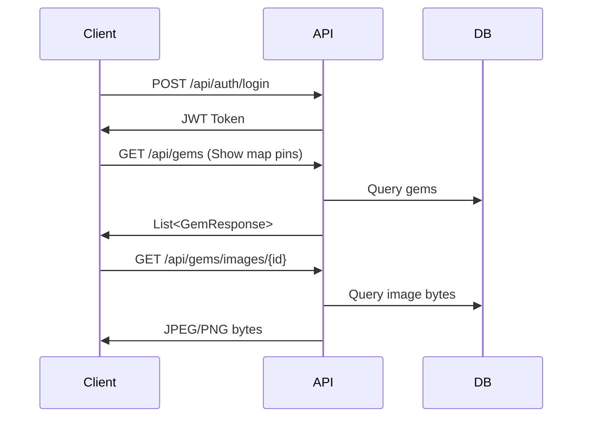
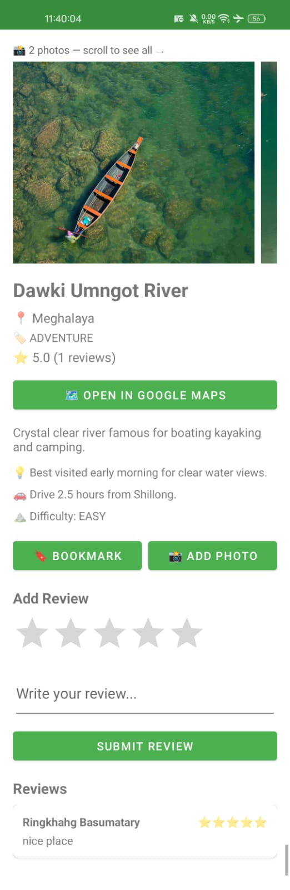
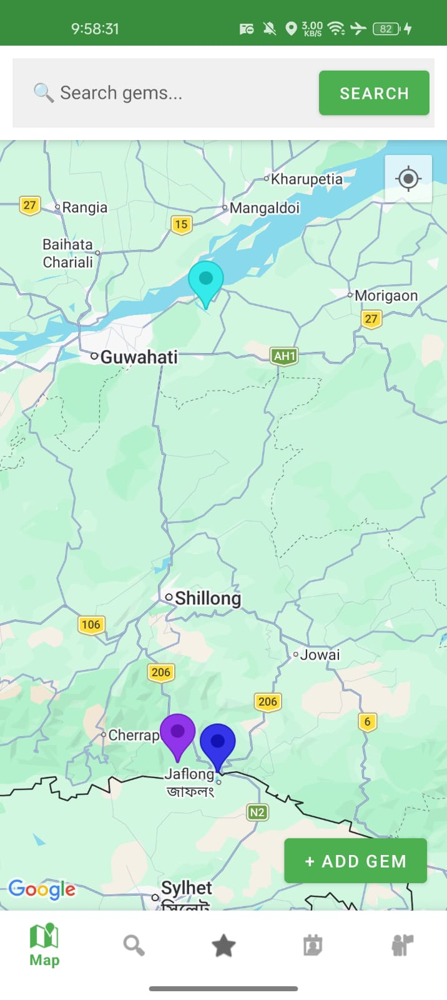
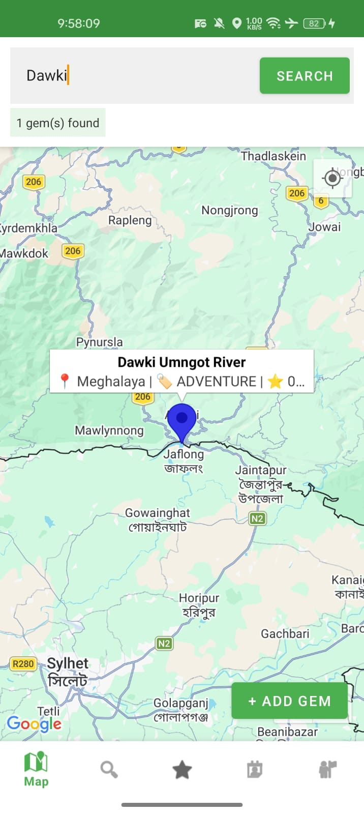
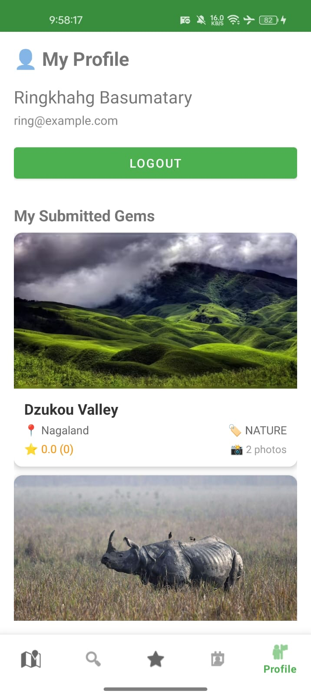
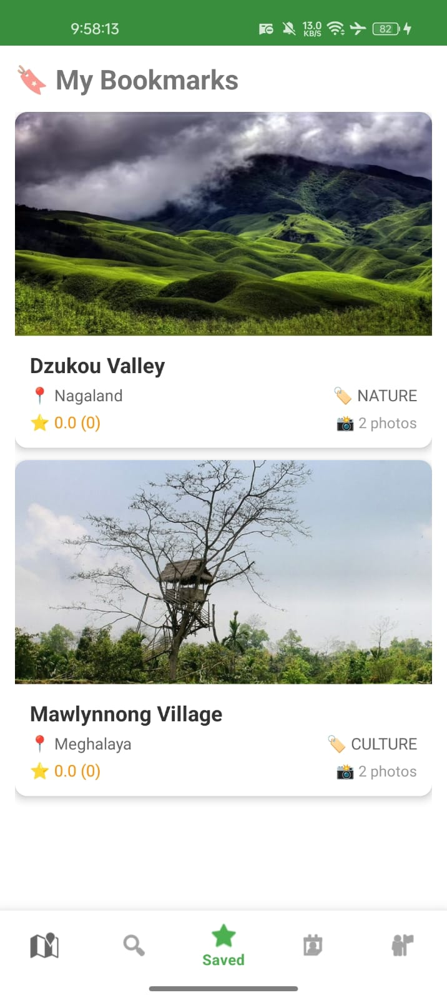

# GONLY: INDIA's Hidden Gems & Events Android App

## 🌏 Project Aim

GONLY is a mobile platform that helps travelers and locals **discover, share, and review lesser-known places and cultural events** across India. It leverages community contributions (photos, reviews) and smart search to highlight gems you won't find in standard guides!

---

## 💡 Core Features

| Feature            | Description                                              |
|--------------------|---------------------------------------------------------|
| 🔐 Auth/JWT        | Secure registration, login & JWT-based sessions         |
| 🗺️ Google Maps     | Map view with gem pins, searchable & interactive        |
| 🏞️ Gem Submission | Add new places, with GPS or manual map pinning          |
| 📸 Photos          | Upload/view gem/event photos + gallery support           |
| 🔍 Smart Search    | Find gems/events by name, category, state, keywords     |
| ⭐ Reviews         | Rate, review places, and read others’ experiences        |
| 🔖 Bookmarks       | Save favorite gems for quick access                     |
| 🎊 Events          | Discover & submit local festivals, fairs, and markets   |
| 🏷️ Filters         | Filter map/search results by category/state             |

---

## 🏗️ Architecture Overview

### 1. Android Client

- **Home:** Map with search bar. Gems shown as colored pins. Tap marker to see details or add new gem.
- **Gem Detail:** Place info, ratings, photos, reviews, and “open in Google Maps”.
- **Add Gem:** Form with GPS/Map pin location, extra details toggle, image picker.
- **Bookmarks/Event/Profile:** List & details screens, login/register, session management.

#### App Navigation



### 2. Backend (Spring Boot REST API)

- **Auth:** JWT, login/register endpoints.
- **Gem/Event CRUD:** Add, get, search, filter, delete, review, bookmark.
- **Images:** Upload (multipart), fetch (raw bytes or Base64 for gallery).
- **Smart Search:** Multi-strategy (name, relevant fields, fuzzy) to handle typos and synonyms.
- **Data Models:** Gems, Events, Reviews, Bookmarks, Images, Users — normalized with relationships.

#### Typical Data Flow



---

## 🛠️ Tech Stack

- **Frontend:** Android (Java), Retrofit, Glide, Google Maps SDK
- **Backend:** Spring Boot, JWT, Hibernate/JPA, PostgreSQL
- **Dev Tools:** IntelliJ, Android Studio, Postman, GitHub

---

## 🚀 Quick Start (Dev)

1. **Backend:**
    - `git clone --> [REPO LINK](https://github.com/RingkhangBTY/Gonly_backend_server)
    - Edit `application.properties` (set DB credentials, allowed upload size)
    - Run: `./mvnw spring-boot:run`
    - Base URL: `http://localhost:8080`

2. **Android:**
    - `git clone --> [REPO LINK](https://github.com/RingkhangBTY/Gonly_android_app)
    - Get Google Maps API key ([setup instructions](https://developers.google.com/maps/documentation/android-sdk/start))
    - Set backend URL in `ApiClient.java` (match PC/local IP)
    - Build & run in Android Studio.

---

## 🔄 REST API Example

```http
POST /api/gems
Content-Type: application/json
Authorization: Bearer <JWT>

{
  "name": "Mawlynnong Village",
  "latitude": 25.2012,
  "longitude": 91.9254,
  "locationSource": "GPS_AUTO",
  "category": "NATURE",
  "state": "Meghalaya",
  "description": "Cleanest village in Asia with living root bridges"
}
```

```http
GET /api/gems/1/images/all
Returns:
[
  {
    "id": 7,
    "imageBase64": "iVBORw0K..."
  },
  ...
]
```

---

## 🙌 Contribution Guidelines

- Fork, branch off `main`, create PRs with clear descriptions.
- Open issues for bugs, feature requests, or architectural questions.
- Add/modify API endpoints with tests and clear Swagger docs.
- Review PRs and discuss major design changes before merging.

---

## 📬 Contact & Support

- **Lead Dev:** RingkhangBTY
- **Email:** ringkhangb913@gmail.com
- **Discussion:** [GitHub Issues](https://github.com/RingkhangBTY/Gonly_backend_server/issues)

---

## 🏆 Credits

- Inspired by the beauty and diversity of North-East India
- Contributions from the community and open-source libraries:
    - Google Maps
    - Glide
    - Spring Boot
    - JWT

---

## 📄 Demo Screenshots

<!-- Add screenshots here, e.g. -->
 
  

---

_GONLY — Explore the hidden gems around you!_